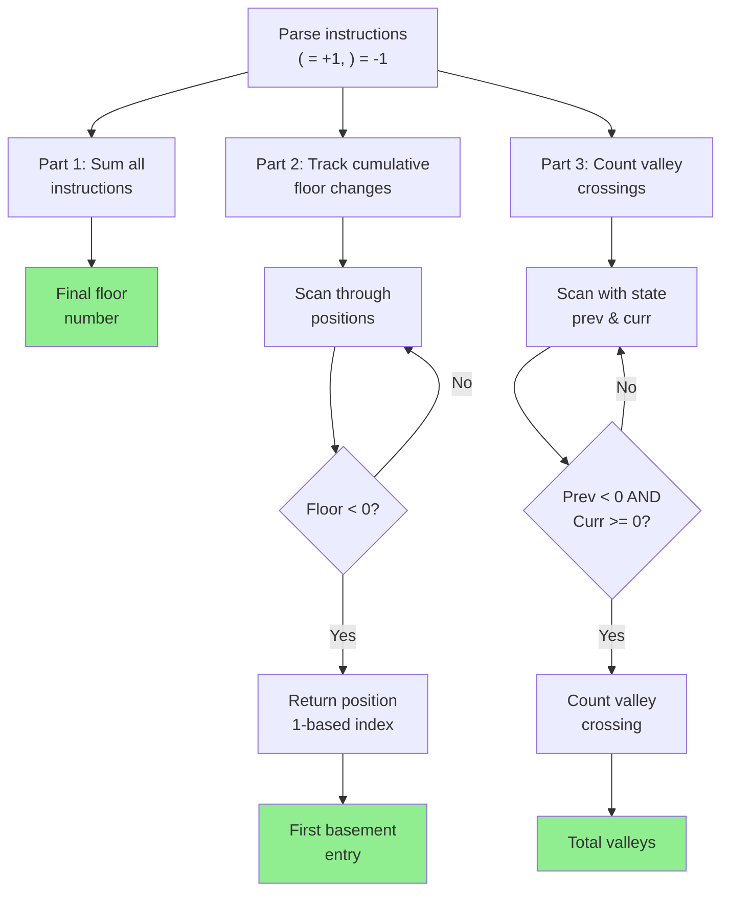

Part 1
===

```file +exec +line_numbers
path: ../examples/2015-12-01.rs
language: rust
# Only show lines 5-10
start_line: 38
end_line: 41
```

<!-- speaker_note: Map characters to elevation changes ( = +1, ) = -1. Simple sum gives the final floor. -->

<!-- end_slide -->

Part 2
===

```file {4-7|9|11} +exec +line_numbers
path: ../examples/2015-12-01.rs
language: rust
# Only show lines 5-10
start_line: 58
end_line: 73
```

<!-- speaker_note: Use scan to maintain state and track position. Position is 1-based, not 0-based. -->

<!-- end_slide -->

Arch
===



<!-- 
speaker_note: |
  adapting for Counting Valleys
  Part 3 reuses the scan pattern from Part 2 but filters on state transitions instead of position. Key insight: track both previous and current elevation to detect valley exits.
  Part 3 adapts the HackerRank counting valleys problem using the same scan pattern. The key difference: filter on state transitions (crossing from negative to non-negative) instead of finding a single position.
-->